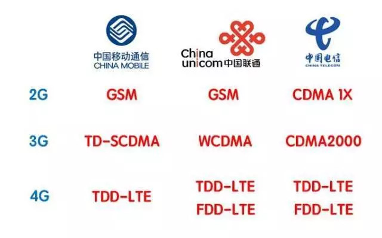
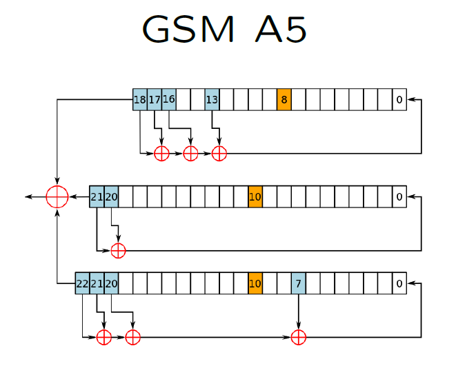

# GSM-a5-1
GSM A5/1算法C语言代码实现和分析
## 介绍
全球超过200个国家和地区超过10亿人正在使用GSM电话。对中国用户来说，GSM就是移动和联通的2g模式。


>在1982年A5首次提出时，人们认为A5 / 1密钥长度要128位，但最终确定的结果是64位密钥（政府可以使用暴力破解算出）。很可能是政府的压力迫使密钥位数缩短。事实上，据说英国认为只需要48位，而当时的西德政府推动更多的位数（因为他们担心东德政府能够破解他们的密码）

A5算法是一款主要用于GSM的加密算法。该算法本身在安装于1亿部移动电话时是秘密。
它最终在1999年8月公布，并在一个月内，A5 / 2方法被破解。
如果没有特别说明，通常所说的A5指的是A5/1。

## 具体分析
A5算法的核心是3个移位寄存器：

上图已经很清楚地说明了A5的移位寄存器的具体工作原理：
三个寄存器的第8，10，10bit是clock bit，意味着每次clock时，算法会计算这三位的多数是0还是1，然后对处于多数的寄存器进行移位操作。
比如说寄存器1的第8位是0，寄存器2的第10位是1，寄存器3的第十位是0。那么多数值就是0，然后对寄存器1和寄存器3进行移位操作。
代码如下：
```c
typedef unsigned long ulong32;
void clock() { 
    ulong32 x1 = ((R1 & R1MID) >> 8) & 1;
    ulong32 x2 = ((R2 & R2MID) >> 10) & 1;
    ulong32 x3 = ((R3 & R3MID) >> 10) & 1;
    ulong32 maj = (x1 + x2 + x3) >= 2 ? 1 : 0; //计算多数值是0还是1
    if (x1  == maj) {
        R1 = clockone(R1, R1MASK, R1TAPS);
    }
    if (x2 == maj) {
        R2 = clockone(R2, R2MASK, R2TAPS);
    }
    if (x3 == maj) {
        R3 = clockone(R3, R3MASK, R3TAPS);
    }
}
```
完整代码实现见GitHub：[]()
## 安全性
人们早在2000年就已经知道A5/1加密算法中存在严重的安全问题了。
在2008年，A5/1加密算法可以在几小时内被破解。
我们可以通过彩虹表攻击破解A5/1：
首先，安全研究人员利用了GSM通信加密中的两个安全漏洞，并且在普通商用硬件的帮助下，花费了55天的时间计算出了一个彩虹表。这个彩虹表的大小为984GB（已在网上公开）。
得到了彩虹表之后，安全专家就可以在几秒内确定用于加密通信数据的密钥了。
具体的攻击步骤见[Do not trust your phone.](https://srlabs.de/wp-content/uploads/2010/07/100729.Breaking.GSM_.Privacy.BlackHat1-1.pdf)

参考资料：
*   Whitfield Diffie's course
*  [A5/1 Pedagogical Implementation](http://www.scard.org/gsm/a51.html)
*  [Real Time Cryptanalysis of A5/1 on a PC](http://cryptome.org/a51-bsw.htm)